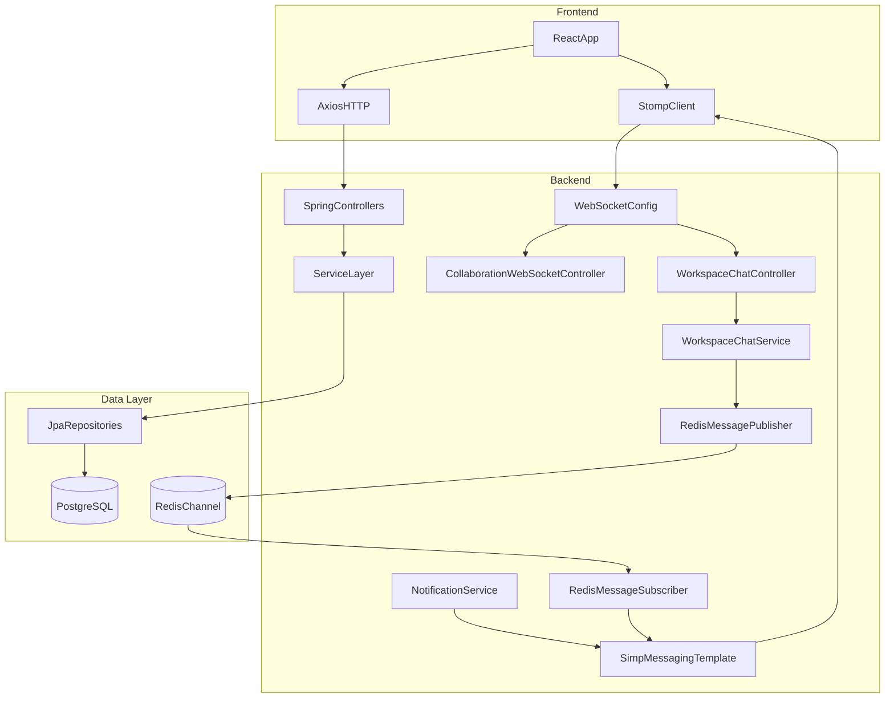

# Distributed Real-Time Collaboration Platform

> **A production-ready collaborative workspace with real-time document editing, team chat, and live notifications — built with Spring Boot 3.2 and React 18**


---

## Problem Statement

Distributed teams waste hours context-switching between disconnected tools — a document editor here, a chat tool there, and a notification system that never quite catches up to real-time changes. Existing solutions either lock teams into opaque SaaS pricing tiers or require significant infrastructure expertise to self-host, making it difficult to own your own data while retaining real-time capabilities. This platform provides a self-hosted, production-deployable collaborative workspace where document editing, team chat, file sharing, and notifications all run over a single unified WebSocket connection secured by JWT — giving teams full data ownership with zero per-seat cost.

---

## Features

- [x] JWT auth with in-memory token storage
- [x] Workspace management with OWNER/ADMIN/MEMBER roles
- [x] Real-time collaborative document editing with version history
- [x] One-click version restore with pre-restore snapshots
- [x] WebSocket workspace chat with Redis Pub/Sub
- [x] File attachments in chat with inline image preview
- [x] Full-text search across documents and messages
- [x] Real-time per-user notifications with unread badge
- [x] Workspace activity feed with live updates
- [x] User profiles with avatar upload
- [x] Admin dashboard with system statistics
- [x] Production Docker setup with health checks and Nginx proxy

---

## Tech Stack

| Category | Technology |
|---|---|
| **Backend** | Spring Boot 3.2 · Java 21 · Maven |
| **Frontend** | React 18 · TypeScript 5 · Vite 5 |
| **Database** | PostgreSQL 16 · Flyway migrations |
| **Cache & Messaging** | Redis 7 · Redis Pub/Sub |
| **Authentication** | JWT · Spring Security · BCrypt |
| **Real-time** | WebSocket · STOMP · SockJS |
| **File Storage** | Local filesystem · configurable path |
| **DevOps** | Docker · Docker Compose · Nginx |

---

## Architecture Overview



---

## Project Metrics

| Metric | Value |
|---|---|
| Backend packages | 8 |
| Frontend folders | 6 |
| Database tables | 9 |
| REST endpoints | 39 |
| WebSocket channels | 6 |
| Flyway migrations | V1 through V5 |

---

## Local Setup

### Prerequisites

- Java 21+
- Node 20+
- Docker 24+
- Maven 3.9+

### Steps

1. **Clone the repository**
   ```bash
   git clone https://github.com/your-username/distributed-real-time-collaboration-platform.git
   cd distributed-real-time-collaboration-platform
   ```

2. **Start infrastructure services**
   ```bash
   docker-compose up -d postgres redis
   ```

3. **Start the backend** (Flyway migrations run automatically on startup)
   ```bash
   cd backend && mvn spring-boot:run
   ```

4. **Start the frontend**
   ```bash
   cd frontend && npm install && npm run dev
   ```

5. **Open the app**
   ```
   http://localhost:5173
   ```

---

## Docker Production

1. Copy the example environment file and fill in all values:
   ```bash
   cp .env.example .env
   ```

2. Build and start all services:
   ```bash
   docker-compose -f docker-compose.prod.yml up --build
   ```

3. Open the app at `http://localhost`

> **Note:** The first run applies all Flyway migrations automatically. Nginx handles SPA routing and proxies `/api` and `/ws` to the backend.

---

## API Overview

| Group | Base Path | Auth Required | Endpoint Count |
|---|---|---|---|
| Auth | `/api/auth` | No | 3 |
| Workspaces | `/api/workspaces` | Yes | 8 |
| Documents | `/api/workspaces/{id}/documents` | Yes | 7 |
| Chat | `/api/workspaces/{id}/messages` | Yes | 2 |
| Files | `/api/files` | Yes | 3 |
| Search | `/api/search` | Yes | 1 |
| Notifications | `/api/notifications` | Yes | 4 |
| Activity | `/api/workspaces/{id}/activity` | Yes | 1 |
| User Profiles | `/api/users` | Yes (except avatar GET) | 6 |
| Admin | `/api/admin` | Yes (ADMIN role) | 4 |

Full API reference: [`docs/api.md`](docs/api.md)

---

## Engineering Decisions

### Why Last-Write-Wins Instead of OT/CRDT for Collaborative Editing

Operational Transformation and CRDT algorithms provide true conflict-free concurrent editing but require either a complex transformation server (OT) or a specialized library with a non-trivial data model (e.g., Yjs, Automerge). Last-write-wins accepts the tradeoff that two users editing the same character position simultaneously will have one edit silently overwrite the other — a rare enough event in practice that it does not meaningfully degrade the user experience for document collaboration with small-to-medium teams. The implementation gains zero external dependencies, fully deterministic behavior, and a model simple enough to audit and debug in production. The 60-second snapshot throttle on the `CollaborationPersistenceScheduler` prevents runaway version history growth while preserving a recoverable audit trail without blocking keystroke broadcast throughput.

### Why Redis Pub/Sub Instead of Direct WebSocket Broadcast

`SimpMessagingTemplate` in Spring's in-memory STOMP broker can only broadcast to clients connected to the same JVM instance, which means a second backend node cannot reach clients connected to the first. Redis Pub/Sub on the `workspace.chat.*` pattern topic introduces a message bus that any backend instance can publish to, and all instances that subscribe receive and re-broadcast to their local WebSocket clients via `RedisMessageSubscriber`. This does not fully solve horizontal scaling because the in-memory broker is still required per instance and WebSocket stickiness must be configured at the load balancer — but it decouples persistence from broadcast and lays the groundwork for migrating to a RabbitMQ STOMP relay with minimal code change.

### Why PostgreSQL Full-Text Search Instead of Elasticsearch

Running Elasticsearch adds an additional stateful service (or a managed cluster cost) that must be kept in sync with the primary database through either dual-writes or a Change Data Capture pipeline — both of which introduce failure modes that complicate operations. PostgreSQL `tsvector` generated columns are updated automatically by the database engine, eliminating the synchronization problem entirely, and GIN indexes make document and message full-text queries fast enough for the expected query load of a self-hosted team tool. The `ts_headline()` function provides match snippet highlighting without any application-level post-processing. Elasticsearch would be appropriate if requirements included fuzzy matching, faceted search, or sub-100ms latency at hundreds of thousands of documents — none of which are current requirements.

### Why JWT in STOMP Headers Instead of Cookies

When a browser upgrades an HTTP connection to WebSocket, the upgrade handshake is an HTTP GET but the resulting WebSocket frames bypass the standard Servlet filter chain, so Spring Security's `JwtAuthFilter` does not execute on subsequent STOMP frames. Cookies are technically transmitted during the upgrade handshake and can be read there, but relying on cookies complicates cross-origin configuration and makes the frontend authentication state harder to reason about when the API and WebSocket share a common token management strategy. The idiomatic solution is to embed the JWT in the STOMP `CONNECT` frame's `Authorization` header and validate it in `WebSocketAuthChannelInterceptor`, which implements `ChannelInterceptor` and fires on every inbound STOMP command — providing per-connection security without touching the HTTP filter chain.

---

## Future Improvements

1. **Replace in-memory STOMP broker with RabbitMQ STOMP relay** for true horizontal WebSocket scaling without per-instance stickiness requirements.
2. **Migrate to S3-compatible storage (MinIO/AWS S3)** for multi-instance file access, eliminating the local filesystem single-point-of-failure.
3. **Add Yjs CRDT integration** for true concurrent edit merging without conflicts, replacing the last-write-wins model at the cost of a client-side library dependency.
4. **Implement refresh token rotation with Redis-based blacklist** for immediate token revocation, addressing the current stateless JWT limitation.
5. **Add Prometheus metrics + Grafana dashboard** for WebSocket connection counts and message throughput observability in production.

---

## Resume Highlights

See [`docs/resume-description.md`](docs/resume-description.md) for copy-paste ready resume bullet points and interview Q&A pairs.

---

## Documentation

| Document | Description |
|---|---|
| [`docs/architecture.md`](docs/architecture.md) | System architecture with 5 Mermaid diagrams |
| [`docs/api.md`](docs/api.md) | Full API reference for all 39 REST endpoints and WebSocket channels |
| [`docs/deployment.md`](docs/deployment.md) | Local development and Docker production deployment guide |
| [`docs/resume-description.md`](docs/resume-description.md) | Resume bullet points and interview Q&A |
| [`docs/DEMO.md`](docs/DEMO.md) | Feature walkthrough with technical implementation notes |

---

## License

This project is licensed under the MIT License.
