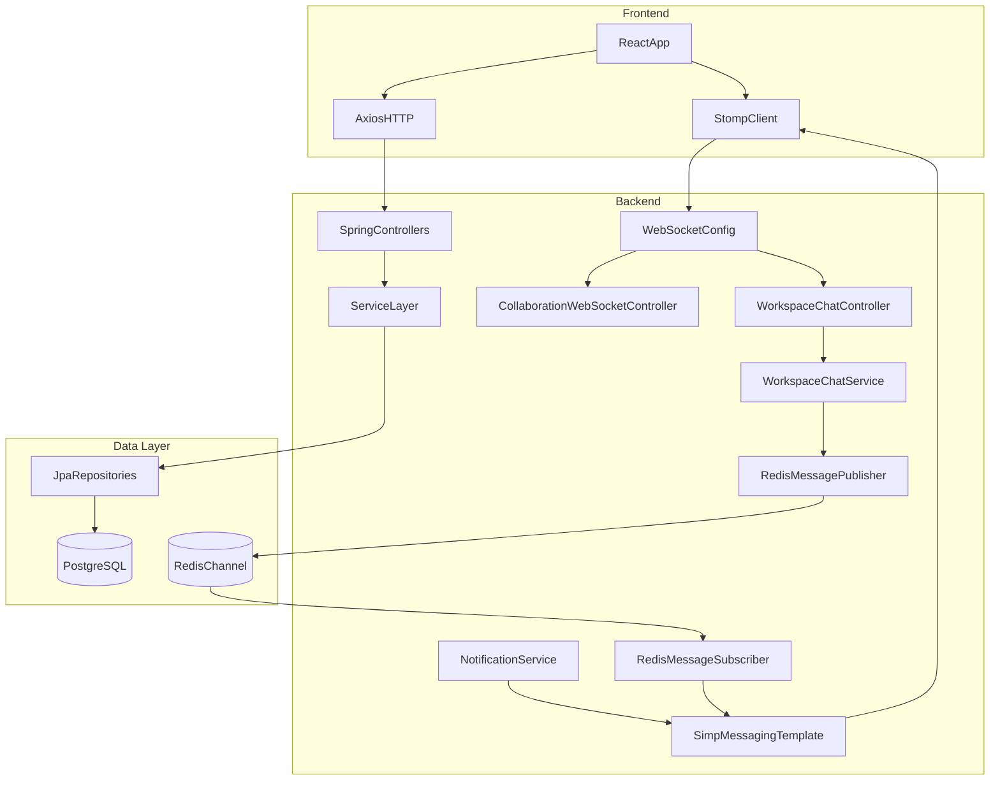
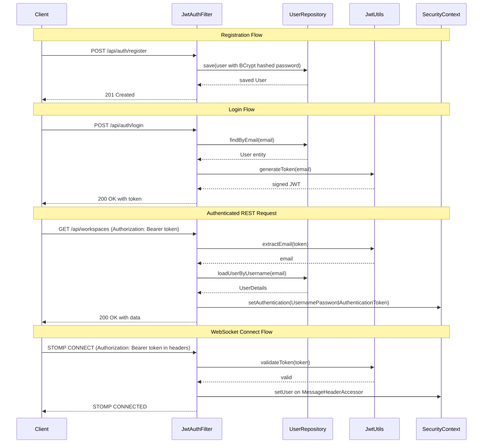
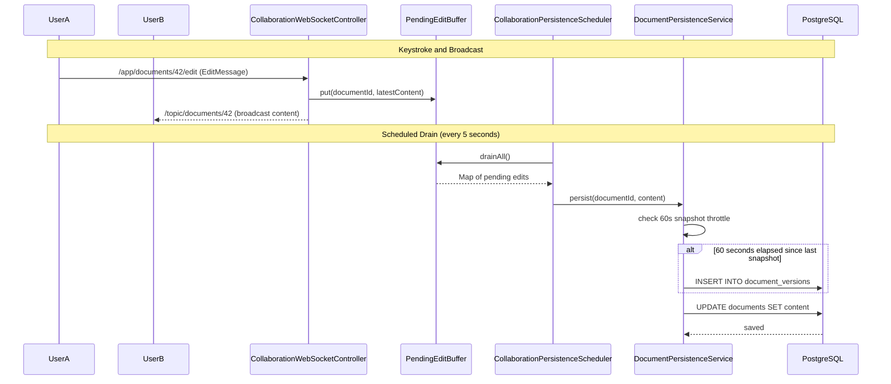
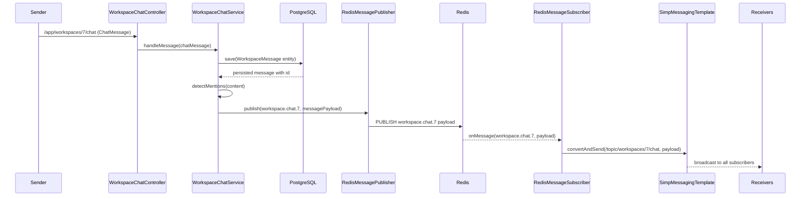
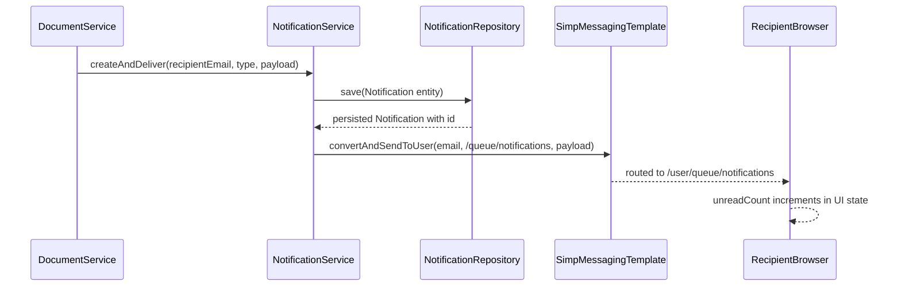

# Architecture

This document describes the system architecture of the Distributed Real-Time Collaboration Platform through five Mermaid diagrams covering the overall system, authentication, collaborative editing, Redis-backed chat, and notification delivery.

---

## Diagram 1 — System Architecture

---

## Diagram 2 — Authentication Flow

---

## Diagram 3 — Collaborative Editing Flow

---

## Diagram 4 — Redis Chat Flow

---

## Diagram 5 — Notification Delivery Flow

